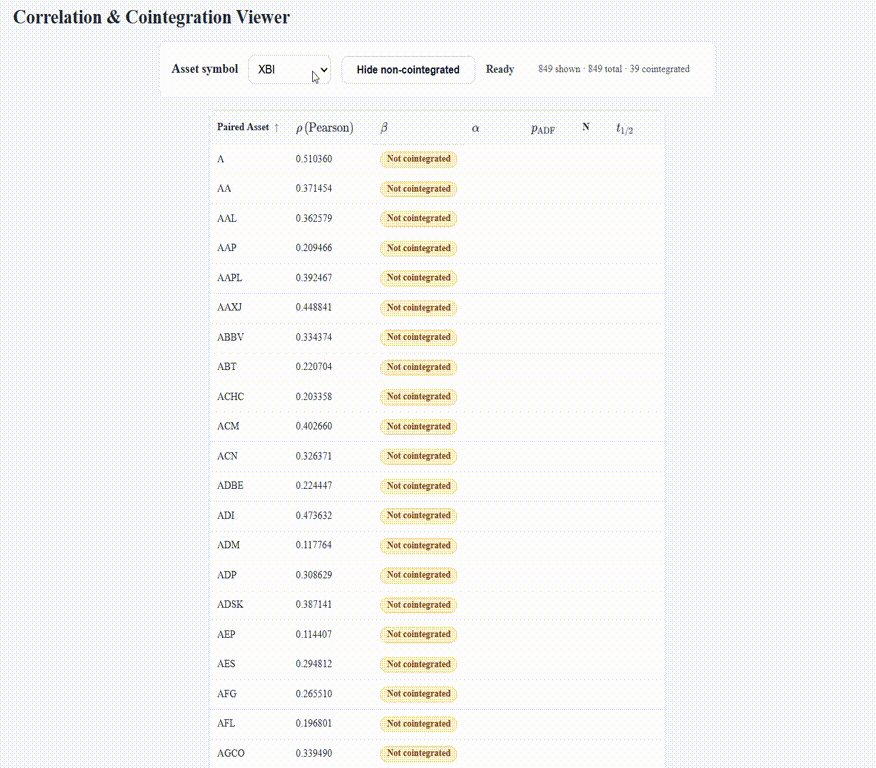

Correlation and Cointegration Analysis with MT5 Data
====================================================

This repository contains a small toolkit for quantitative research on financial time series using data sourced from MetaTrader 5 (MT5). The scripts in this directory support two closely related workflows:

- **Correlation analysis** of asset returns and prices.
- **Cointegration analysis** for discovering mean-reverting spreads suitable for pairs trading and related strategies.

The detailed usage instructions for each workflow are documented in separate, focused READMEs:

- [README_correlation.md](./README_correlation.md) — how to:
  
  - download OHLC data from MT5 into `data/` via `fetch_ohlc_mt5.py`, and
  - compute pairwise, one-vs-all, and all-vs-all correlations with `correlation_analysis.py`.

- [README_cointegration.md](./README_cointegration.md) — how to:
  
  - collect a daily OHLC universe in `data/`,
  - screen assets for I(1) behaviour using `stationarity_check.py`, and
  - search for cointegrated pairs and construct spreads using `cointegration_pairs_scan.py`.

- [README_html.md](./README_html.md) — how to:
  
  - start the local web server for `index.html`,
  - open the visualization app in a browser, and
  - interactively explore/sort/filter correlation and cointegration outputs.

Directory structure
-------------------

At a high level, the project uses the following structure:

- `fetch_ohlc_mt5.py` — MT5 data downloader (writes OHLC CSVs to `data/`).
- `correlation_analysis.py` — correlation analysis on stored CSV data.
- `stationarity_check.py` — ADF/PP-based stationarity screening for cointegration.
- `cointegration_pairs_scan.py` — Engle–Granger pairwise cointegration search.
- `data/` — raw OHLC data from MT5.
- `output/` — analysis outputs (correlation tables, stationarity results, cointegrated pairs, etc.).
- [README_correlation.md](./README_correlation.md) — detailed correlation-analysis documentation.
- [README_cointegration.md](./README_cointegration.md) — detailed cointegration-analysis documentation.
- [README_html.md](./README_html.md) — HTML data-visualization app usage guide.

Getting started
---------------

1. **Set up your environment**
   
   - Install Python 3.10+.
   - Install required Python packages (see the Requirements sections in the two detailed READMEs).
   - Ensure you have a configured MetaTrader 5 terminal on the same machine.

2. **Choose your workflow**
   
   - For correlation-focused research (e.g. portfolio diversification, identifying negatively correlated assets), start with [README_correlation.md](./README_correlation.md).
   - For cointegration and pairs trading (e.g. building mean-reverting spreads), start with [README_cointegration.md](./README_cointegration.md).

3. **Run the scripts as described**
   
   - Use `fetch_ohlc_mt5.py` to populate `data/` with the instruments and timeframes of interest.
   - Follow the step-by-step instructions in the respective README to generate analysis outputs in `output/`.

4. **Visualize outputs in the browser (optional)**
   
   - After generating `output/correlation_matrix.csv` and `output/cointegrated_pairs.csv`, follow [README_html.md](./README_html.md) to launch and use the `index.html` visualization app.
   
   - Demo preview:
     
     

The two workflows are designed to be complementary: you can use correlation analysis to understand cross-asset relationships at the return level, and cointegration analysis to identify deeper long-run equilibrium relationships suitable for market-neutral trading strategies.
